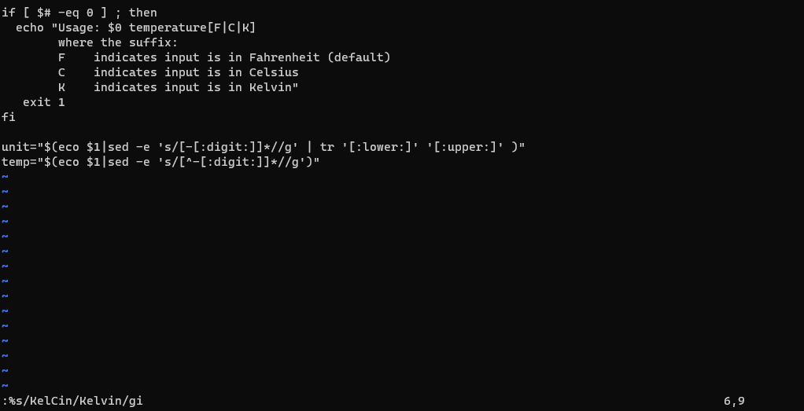
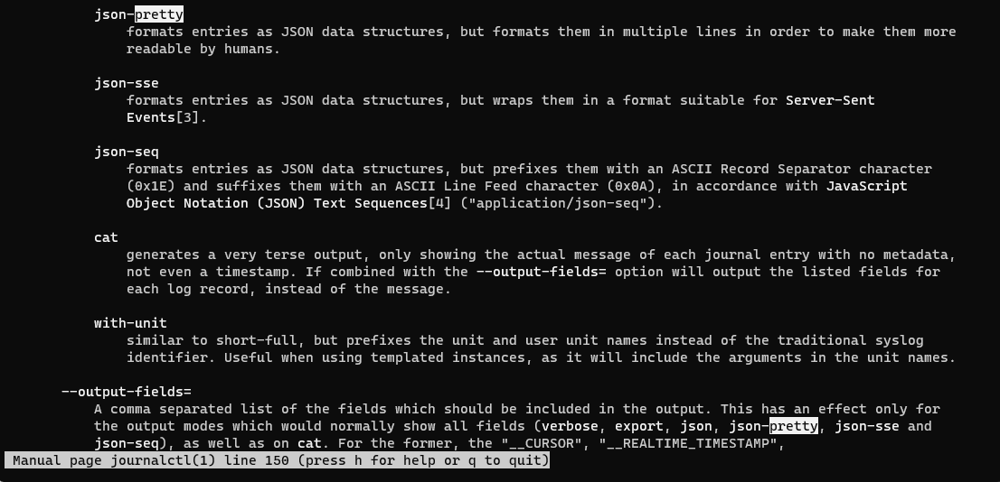
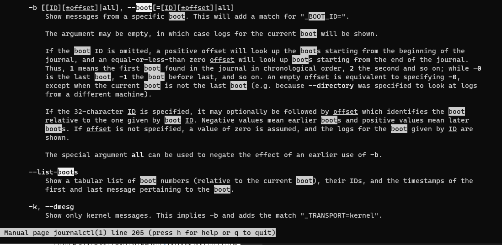
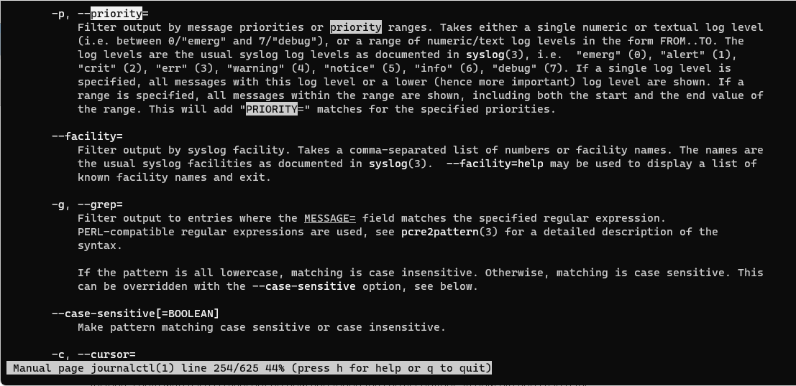
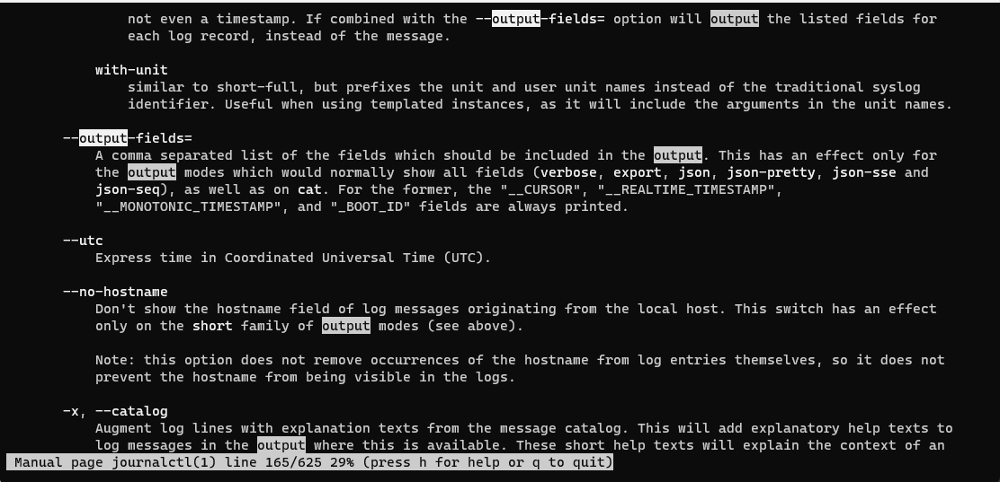
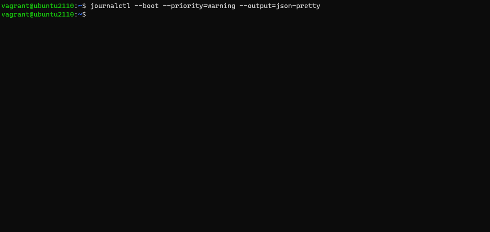
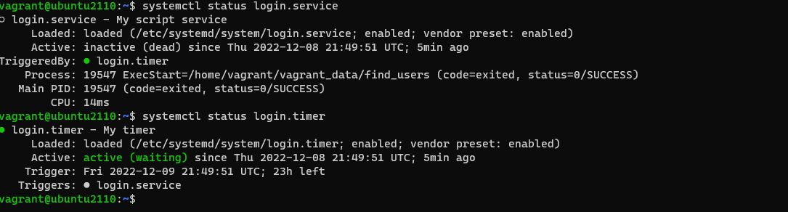

# Final

### 1 How could you update most of the software on your Ubuntu OS?
```
sudo apt update  
sudo apt upgrade
```

### 2 Fix the code with Vim

1. use :%s/numbs/:digit:/g to repalce numbs with digit
2. use :%s/V/C/gi to repace all V with C  
3. press gg to go to head of the file
4. use :s/1/0/g repace 1 to 0 
5. %s/KelCin/Kelvin/gi replace kelCin to Kelvin



# 3 journalctl out put
1. use journalctl --boot --priority=warning --output=json-pretty





2. no warrning seems like


# 4 scrip 
```
#!/bin/bash 
#: Title 	        : get OS 
#: Date 		      : Oct 20 2022 
#: Author 		    : Jacky Hsu
#: Version 		    : 0.5b
#: Description 		: print sysinfo with penguin  
#: Options 		    : -f -h


filepath="/etc/passwd"

users=$(grep ':[1-9][0-9][0-9][0-9]:' $filepath | awk '{ print $1" "$3" "$7}' FS=:)

who=$(who | awk '{ print $1 }')


printf "the regulor user in this system are: \n"
printf "$users\n"
printf "\n"
printf "the users that is logged in is: \n"
printf "$who\n"

```


# 5 timer
service file
```
[Unit]
Description=My script service
BindsTo=login.timer

[Service]
Type=simple
ExecStart=/home/vagrant/vagrant_data/find_users

[Install]
WantedBy=multi-user.target
```

timer file
```
[Unit]
Description=My timer

[Timer]
OnBootSec=1min
OnUnitActiveSec=1day

[Install]
WantedBy=timers.target

```
